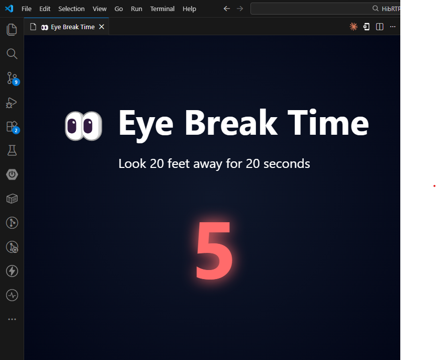

# 👀 20-20-20 Eye Care Extension

**20-20-20** is a lightweight VS Code extension designed to help developers protect their eyes and reduce strain during long coding sessions.

It follows the scientifically recommended **20-20-20 rule**:
> Every 20 minutes, look at something 20 feet away for 20 seconds.

---

## ✨ Features

- ⏱ Automatically triggers a break every **20 minutes**
- 🪟 Displays a fullscreen eye-break reminder
- 👀 Helps reduce eye strain and fatigue
- 🔁 Automatically restarts the cycle after each break
- 🚫 Prevents skipping or ignoring break reminders

---

## 🛠 How It Works

### ⏳ Automatic Break Timer

Once activated, the extension runs in the background and triggers a break screen every:

`20 minutes (default)`

---

### 👀 Break Screen

When triggered, a fullscreen Webview appears showing:

- A countdown timer (20 → 0)
- Eye-care instructions
- Focus reminder to look away from the screen

The break screen automatically closes after the countdown ends.

---

## 💡 Commands

| Command                        | Description                              |
| ------------------------------ | ---------------------------------------- |
| `Start 20-20-20 Break Cycle`   | Starts the automatic break timer system  |

You can also run it from the **Command Palette** (`Ctrl + Shift + P`).

---

## ⚙️ Configuration (Future Improvement)

Planned features:

- ⏱ Custom break interval (10–60 minutes)
- 🔔 Sound notifications
- 🔘 Enable/disable toggle
- 📊 Focus tracking dashboard

---

## 📌 Notes

- The extension runs automatically when VS Code starts
- Break intervals are currently fixed
- No data is stored or tracked externally
- Designed to be lightweight and distraction-free

---

## 🧑‍💻 Author

### Dagim Awulachew

**Built with ❤️ using Node.js and the VS Code Extension API**

## 🧑‍💻 Screenshot

